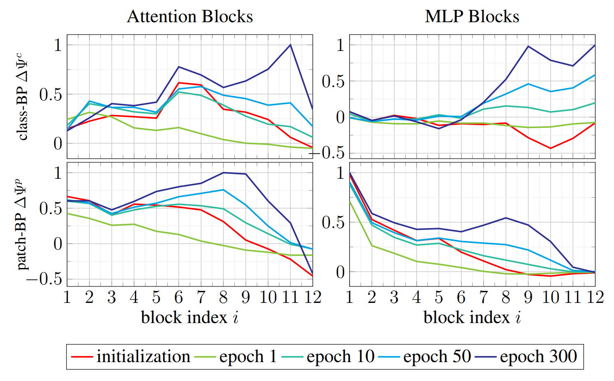

# Depth Aware Pruning


This GitHub repository contains the code for our paper: **Depth Aware Pruning: Sparsify Vision Transformer by Retaining High-Performing Blocks**

 Abstract:
>Vision Transformer have set new benchmarks in several tasks, but these models come with the lack of high computational costs which makes them impractical for resource limited hardware. Network pruning reduces the computational complexity by removing less important operations while maintaining performance. However, when a pretrained model is pruned before convergence in an unseen data domain, it can lead to a misevaluation of weight significance, resulting in an unfavourable resource assignment. To face the issue of removing elements too early in training, we propose Depth Aware Pruning (DAP), which assigns model parameters dependent on the state of convergence. Our proposed method identifies the changing impact of task specific features and rebalances the computational resources to boost lately converged components. 

---


<p align="center">

</p>
> The relative feature improvement on classification token (upper row) and patches (botton row) for individual Attention and MLP blocks is depth dependent.
> Deeper layers express features only in later epochs.


When applying pruning strategies to transfer learning tasks, the discrepancy between the initial model domain and the target domain of the downstream task must be considered.
Neglecting this factor leads to unfavourable pruned weights, ultimately causing performance degradation when model parameters are eliminated prematurely.
Moreover, our work points out an overlooked aspect in pruning, regarding the model depth.
As visualized in the figure above, deeper layers converge later in training, harming early pruning decisions.
This raises the question: "When to prune individual layers"?


We propose the novel pruning framwork **Depth Aware Pruning (DAP)** to balance the global parameter resources dependent on the feature improvement of Attention and MLP blocks.
*DAP* is a highly performant pruning framework, considering the structural change of the model during domain adaptaion.
As shown in the following table, DAP significantly outperforms existing pruning methods.


 | model      | method         | pruned  | IFOOD <br> pr=50%   | IFOOD <br> pr=75%   | INAT19 <br> pr=50%  | INAT19 <br> pr=75%  |
 |:-----------|:---------------|:--------|:-------------------:|:-------------------:|:-------------------:|:-------------------:|
 | Deit-Small | Deit           | &cross; | 73.9                                     || 74.7                                     ||
 |            | WD-Prune       | &check; | 50.7                | 49.2                | 55.6                | 54.0                |
 |            | SaVit          | &check; | 72.4                | 64.4                | 71.3                | 68.0                |
 |            | **DAP (ours)** | &check; | **74.3**            | **73.4**            | **75.5**            | **73.1**            |
 | Deit-Tiny  | Deit           | &cross; | 72.7                                     || 72.6                                     ||
 |            | WD-Prune       | &check; | 50.2                | 44.7                | 54.8                | 46.7                |
 |            | SaVit          | &check; | 65.7                | 59.5                | 64.1                | 45.3                |
 |            | **DAP (ours)** | &check; | **71.5**            | **68.6**            | **69.3**            | **61.4**            |

<br>

---

## Install
<checkout repository>
checkout our repository

```
git clone https://anonymous.4open.science/r/DepthAwarePruning-DE53
cd DepthAwarePruning
```

<install environment>
Use the provided `requirements.txt` file to create a conda environment for this project: 

```
conda create --name DAP --file requirements.txt
```


---

## Run

prune model with DAP
```
python -m torch.distributed.launch --nproc_per_node=4 --master_port $used_port --use_env main.py --output_dir $OUTPUT_DIR --epochs 50 --batch-size 64 --grad-accum-steps 2 --data-set CIFAR100 --data-path $PATH_DATASET --model deit_small_patch16_224 --model-path $MODEL_PATH --prune-method "block_pr" --prune-ratio $PRUNE_RATIO --prune-steps-update-mask 100 --prune-start-epoch 10 --dist-eval
```
*Note: we scale argument "prune-steps-update-mask" to 3 mask update steps per epoch.*

fine-tune pruned model
```
python -m torch.distributed.launch --nproc_per_node=4 --master_port $used_port --use_env main.py  --output_dir $OUTPUT_DIR --batch-size 128 --data-set CIFAR100 --data-path $PATH_DATASET --model deit_small_patch16_224 --model-path ${OUTPUT_DIR}/first_sparse_checkpoint.pth --resize-model-by-checkpoint --dist-eval
```


