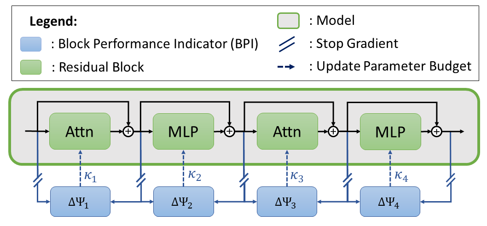
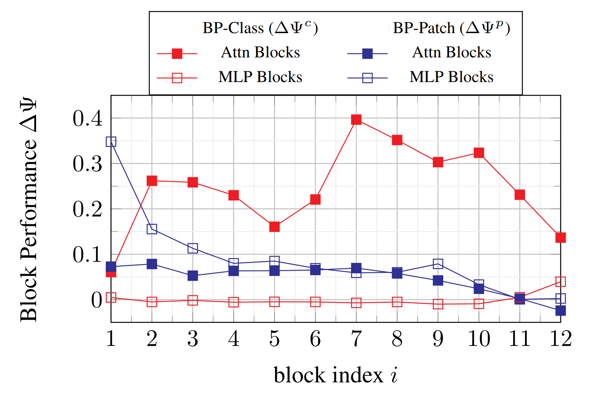

# Depth Aware Pruning

 Abstract:
>Vision Transformer have set new benchmarks in several tasks, but these models come with the lack of high computational costs which makes them impractical for resource limited hardware. Network pruning reduces the computational complexity by removing less important operations while maintaining performance. However, when a pretrained model is pruned before convergence in an unseen data domain, it can lead to a misevaluation of weight significance, resulting in an unfavourable resource assignment. To face the issue of removing elements too early in training, we propose Depth Aware Pruning (DAP), which assigns model parameters dependent on the state of convergence. Our proposed method identifies the changing impact of task specific features and rebalances the computational resources to boost lately converged components. We show in extensive experiments that our method DAP sets a new state of the art with most noticeable gains in transfer learning tasks. Notably, DAP is able to conserve high performance, even in high sparsity regimes of 70% parameter reduction while only losing 0.64% in accuracy.

---

Depth Aware

> The Block Performance Indicator (BPI) measures the
relative performance gain towards the goal task for every Attention
(Attn) and MLP block. The BPI-metric is used to update the block
keep ratio κbi , where blocks with higher performance gain are
assigned more parameter. We apply a stop gradient operator to
avoid propagating BPI-gradients through the model.

> Relative performance gain of Attention and MLP blocks
measured by ∆Ψi. DAP is applied to Deit-S on Imagenet-1K with
pruning rate 50%. The results show that only Attention blocks in-
crease the classification tokens discriminance. MLP blocks mainly
contribute to semantic patch tokens in a decreasing manner.

 | model      | method         | pruned  | IFOOD   pr=50%   | IFOOD   pr=75%   | INAT19   pr=50%  | INAT19   pr=75%  |
 |:-----------|:---------------|:--------|:-------------------:|:-------------------:|:-------------------:|:-------------------:|
 | Deit-small | Deit           | &cross; | 73.9                                     || 74.7                                     ||
 |            | WD-Prune       | &check; | 50.7                | 49.2                | 55.6                | 54.0                |
 |            | SaVit          | &check; | 72.4                | 64.4                | 71.3                | 68.0                |
 |            | **DAP (ours)** | &check; | **74.3**            | **73.4**            | **75.5**            | **73.1**            |
 | Deit-tiny  | Deit           | &cross; | 72.7                                     || 72.6                                     ||
 |            | WD-Prune       | &check; | 50.2                | 44.7                | 54.8                | 46.7                |
 |            | SaVit          | &check; | 65.7                | 59.5                | 64.1                | 45.3                |
 |            | **DAP (ours)** | &check; | **71.5**            | **68.6**            | **69.3**            | **61.4**            |

 

---

## Install

---

## Run
=======
# Depth Aware Pruning: Sparsity Vision Transformers by Retaining High-Performoing Blocks

