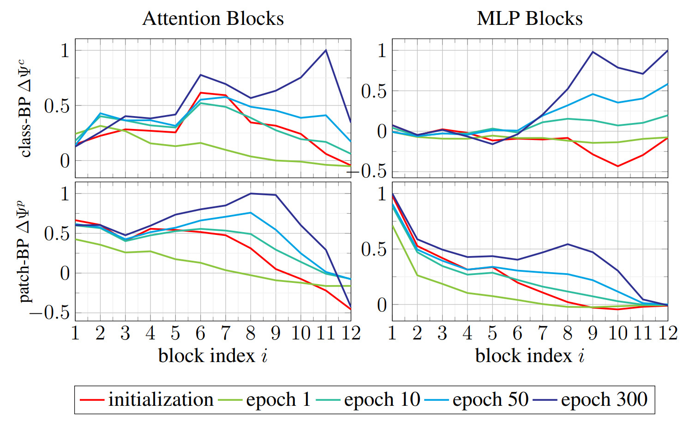

 
    <h1> Pruning by Block Benefit: Exploring the Properties of Vision Transformer Blocks during Domain Adaptation </h1>

 

---

Vision Transformer have set new benchmarks in several tasks, but these models come with the lack of high computational costs which makes them impractical for resource limited hardware. Network pruning reduces the computational complexity by removing less important operations while maintaining performance. However, pruning a pretrained model on an unseen data domain, leads to a misevaluation of weight significance, resulting in an unfavourable resource assignment. To address the issue of efficient pruning on transfer learning tasks, we propose Pruning by Block Benefit (P3B) , a method to globally assign a given parameter budget depending on the relative contribution of individual blocks. Our proposed method is able to identify lately converged components in order to rebalance the global parameter resources. Furthermore, our findings show that the order in which layers express valuable features on unseen data depends on the network depth, leading to a structural problem in pruning.

This GitHub repository contains the code for our paper: **Pruning by Block Benefit: Exploring the Properties of Vision Transformer Blocks during Domain Adaptation**

---

The relative feature improvement on classification token (upper row) and patches (botton row) for individual Attention and MLP blocks is depth dependent.
Deeper layers express features only in later epochs.

When applying pruning strategies to transfer learning tasks, the discrepancy between the initial model domain and the target domain of the downstream task must be considered.
Neglecting this factor leads to unfavourable pruned weights, ultimately causing performance degradation when model parameters are eliminated prematurely.
Moreover, our work points out an overlooked aspect in pruning, regarding the model depth.
As visualized in the figure above, deeper layers converge later in training, harming early pruning decisions.
This raises the question: "When to prune individual layers"?

We propose the novel pruning framwork **Pruning by Block Benefit (P3B)** to balance the global parameter resources dependent on the feature improvement of Attention and MLP blocks.
*P3B* is a highly performant pruning framework, considering the structural change of the model during domain adaptaion.
As shown in the following table, *P3B* significantly outperforms existing pruning methods.

 | model      | method         | pruned  | IFOOD   pr=50%   | IFOOD   pr=75%   | INAT19   pr=50%  | INAT19   pr=75%  |
 |:-----------|:---------------|:--------|:-------------------:|:-------------------:|:-------------------:|:-------------------:|
 | Deit-Small | Deit           | &cross; | 73.9                                     || 74.7                                     ||
 |            | WD-Prune       | &check; | 50.7                | 49.2                | 55.6                | 54.0                |
 |            | SaVit          | &check; | 72.4                | 64.4                | 71.3                | 68.0                |
 |            | **P3B (ours)** | &check; | **74.3**            | **73.4**            | **75.5**            | **73.1**            |
 | Deit-Tiny  | Deit           | &cross; | 72.7                                     || 72.6                                     ||
 |            | WD-Prune       | &check; | 50.2                | 44.7                | 54.8                | 46.7                |
 |            | SaVit          | &check; | 65.7                | 59.5                | 64.1                | 45.3                |
 |            | **P3B (ours)** | &check; | **71.5**            | **68.6**            | **69.3**            | **61.4**            |

 

---

